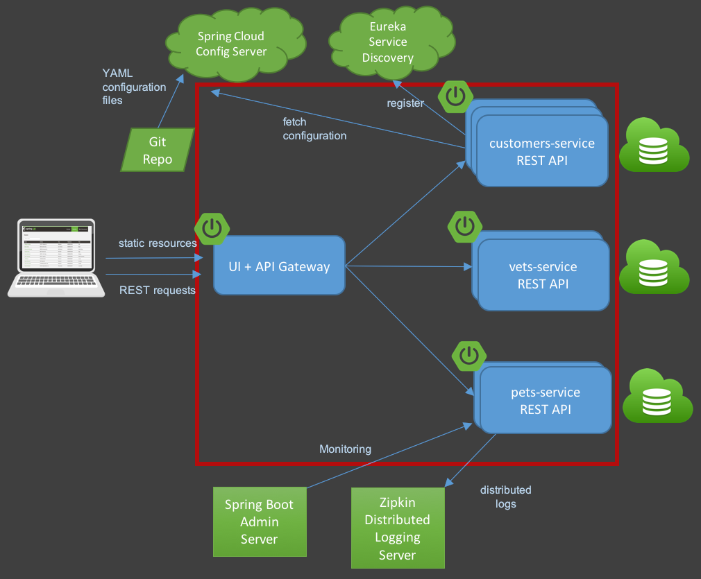

# Lab cloud IaaS

## Login
Durant ce TP, vous devrez vous connecter au cloud Azure via un `appId` et `password`. Cet `appId` et `password` se trouve dans le fichier `password.txt` qui vous sera donné. Vous avez chacun un `appId` et `password` qui correspond normalement à votre `prenom.nom`.

## Instructions
Durant ce TP, nous allons voir comment manipuler la partie IaaS du cloud que nous avons vu durant les cours. Pour ce faire, nous allons déployer l'application PetClinic.

Voici à quoi ressemble l'architecture de l'application PetClinic


## 1 : IaaS
Dans un premier temps, nous allons déployer cette architecture sur une machine virtuelle.

### 1.0 : Setup du TP
* Cloner votre repository `lab-cloud-iaas-<username>` sur votre ordinateur
* [Télécharger et installer la CLI d'Azure](https://docs.microsoft.com/en-us/cli/azure/install-azure-cli?view=azure-cli-latest)

### 1.1 : Se connecter à Azure
Pour se connecter, lancer la commande suivante:
```
az login --service-principal -u <appId> -p <password> --tenant c8709a2a-70b6-49b5-bdd5-6868b476da85
```
Ou `<appId>` correspond au bloc ou `displayName` est votre `prenom.nom` et le `<password>` correspondant

### 1.2 : Créer une machine virtuelle Azure
Lancer la commande suivante
```
az vm create --name vm-<displayName> --resource-group rg-<displayName> --admin-username azureuser --generate-ssh-keys --image UbuntuLTS --size B2s
```
Cette commande va créer une machine virtuelle dans votre environnement cloud dédié

### 1.3 : Se connecter à la machine
Une fois la machine virtuelle créée, se connecter à la machine
```
ssh azureuser@<public-ip>
```

### 1.4 : Installer les outils nécessaires
Installer ensuite les outils nécessaires au démarrage de l'application. Pour faire tourner correctement l'application, les outils à installer sont : `git`, `maven` et `openjdk-8-jdk`
> ⚠️  **WARNING**: Créez une issue s'intitulant `2.4` ayant pour contenu les commandes que vous avez effectuées

### 1.5 : Cloner le repo Spring PetClinic
Au sein de votre VM, cloner le repo PetClinic https://github.com/spring-projects/spring-petclinic
> ⚠️  **WARNING**: Créez une issue s'intitulant `2.5` ayant pour contenu les commandes que vous avez effectuées

### 1.6 : Lancer Spring PetClinic
Lancer la commande suivante afin de compiler, puis lancer l'application
```
cd spring-petclinic
./mvnw package
java -jar target/*.jar
```

### 1.7 : Se connecter à l'application
Maintenant, se connecter à l'application
> ⚠️  **WARNING**: Créez une issue s'intitulant `2.7` expliquant pourquoi il est impossible de se connecter à l'application

### 1.8 Ouvrir le firewall
Executer la commande suivante afin de récupérer le nom de la machine virtuelle
```
az vm list --query "[0].name"
```
Ensuite, ouvrir le firewall
```
az vm open-port --resource-group <resourcegroup> --name <vm-name> --port <port>
```
> ⚠️  **WARNING**: Créez une issue s'intitulant `2.8` ayant pour contenu les commandes que vous avez effectuées

### 1.9 : Vérifier le bon fonctionnement
Ouvrir le navigateur et aller à l'url suivante afin de voir l'application Petclinic : `http://<public-ip>:<port>`

### 1.10 : Installer MariaDB
Par défault, l'application démarre sans serveur de base de données et donc ne persiste pas les données que vous pouvez modifier. Afin de pouvoir persister les données, il est nécessaire d'installer MariaDB et de modifier le fichier de configuration de l'application afin de pointer sur la base de données.

Installer MariaDB en suivant le mode opératoire suivant : https://www.digitalocean.com/community/tutorials/how-to-install-mariadb-on-ubuntu-20-04
> ⚠️  **WARNING**: Créez une issue s'intitulant `2.10` ayant pour contenu les commandes que vous avez effectuées

### 1.11 : Installer les schémas et les données
Dans le repo git, il existe les instructions afin de créer la base de données PetClinic. Ces instructions sont situés ici : `spring-petclinic/src/main/resources/db/mysql/`

Le fichier txt présent dans le répertoire fait référence à Docker. Dans le cadre de ce TP, nous n'allons pas installer Docker, puisque nous avons déjà installé MariaDB.

Les fichiers à jouer sur la base de données MariaDB sont dans l'ordre : `user.sql`, `schema.sql` et `data.sql`. Il faut alors trouver comment appliquer des fichiers SQL en ligne de commande à MariaDB

### 1.12 : Redémarrer l'application
Redémarrer l'application PetClinic avec le bon profil afin que l'application puisse utiliser le serveur MySQL.
