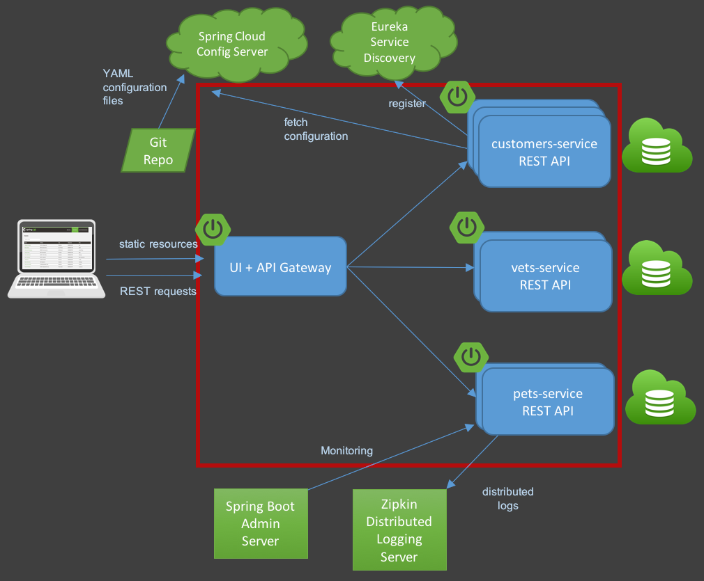

# TP Cloud PaaS et Serverless

## Login
Durant ce TP, vous devrez vous connecter au cloud Azure via un `appId` et `password`. Ce `appId` et `password` se trouve dans le fichier `password.txt` qui est disponible sur Teams. Vous avez chacun un `appId` et `password` qui correspond normalement à votre `prenom.nom`.
Ce sont les même `appId` et `password` que ceux lors du premier TP cloud.

## Instructions
Durant ce TP, nous allons voir comment manipuler la partie PaaS et Serverless du cloud que nous avons vu durant les cours. Pour ce faire, nous allons déployer l'application PetClinic de deux manière différentes, l'une en PaaS, l'autre en Serverless.

Voici à quoi ressemble l'architecture de l'application PetClinic


Les réponses aux questions posées dans cet énoncé doivent être soumises sous forme d'issue GitHub au sein de votre copie de repository. 
Chaque réponse fera l'objet d'une nouvelle issue dans votre repo. 
> Les questions requérant une réponse sous forme d'issue seront taggées par l'icone suivante: ⚠️ 

> Les commits ne sont pas facultatifs. **Commitez au minimum dès que l'énoncé vous le demande**.

Le TP doit être rendu individuellement et se basera sur les réponses présentes dans les issues, ainsi que sur le code présent dans vos repositories personnels.

## 1 : PaaS
Dans un premier temps, nous allons déployer cette architecture dans le PaaS d'Azure qui s'appelle Azure AppService.
> Le composant `Azure AppService` s'appelait `Azure WebApp` avant, ne vous étonnez donc pas si vous trouvez dans la littérature les deux appelations.

### 1.0 : Setup du TP
* Cloner votre repository `lab-cloud-paas-serverless-<username>` sur votre ordinateur.
* Toutes les commandes à jouer sont à faire sur votre poste de travail, et non sur la machine virtuelle comme le dernier TP.

### 1.1 : Cloner le repo
Récupérer le projet PetClinic : https://github.com/spring-projects/spring-petclinic

### 1.2 : Modifier le pom.xml
Modifier le fichier `pom.xml` afin d'ajouter le plugin Azure. Ces lignes doivent être ajouter dans la partie `<build>` à partir de la ligne 125.
> ⚠️  **WARNING**: Veillez à bien modifier la balise `<resourceGroup />` en remplacant la balises `<login>` par votre `prenom.nom`

> ⚠️  **WARNING**: Veillez à bien modifier la balise `<appName />` en remplacant les balises `<your-app-name>` par `web-prenomnom` (il ne faut pas mettre de point dans l'appName sous peine d'un refus lors de la création)

> ⚠️  **WARNING**: Veillez à bien modifier la balise `<appServicePlanName />` en remplacant les balises `<your-app-serviceplan-name><` par `appservice-prenomnom` (il ne faut pas mettre de point dans l'appName sous peine d'un refus lors de la création)

Dans la suite de la partie 1, vous utiliserez l'appName comme un identifiant autant de fois qu'il le faudra (en gardant la forme que vous avez utilisé ci-dessous: `web-prenomnom`)
```xml
<plugin>
    <groupId>com.microsoft.azure</groupId>
    <artifactId>azure-webapp-maven-plugin</artifactId>
    <version>2.2.1</version>
    <configuration>
        <schemaVersion>v2</schemaVersion>
        <resourceGroup>rg-<prenom.nom></resourceGroup>
        <appServicePlanName><your-app-serviceplan-name></appServicePlanName>
        <appName><your-app-name></appName>
        <pricingTier>F1</pricingTier>
        <region>westeurope</region>
        <runtime>
            <os>linux</os>
            <javaVersion>jre8</javaVersion>
          </runtime>
          <deployment>
            <resources>
              <resource>
                <directory>${project.basedir}/target</directory>
                <includes>
                  <include>*.jar</include>
                </includes>
              </resource>
            </resources>
          </deployment>
          <stopAppDuringDeployment>true</stopAppDuringDeployment>
    </configuration>
</plugin>
```

Il faudra aussi modifier la version de JaCoCo pour la passer en version `0.8.7`

```xml
    <jacoco.version>0.8.7</jacoco.version>
```

### 1.3 : Recompilation
Avant de pouvoir compiler et déployer l'application dans Azure, il est nécessaire d'installer et configurer Java JDK. Plus d'informations ici https://adoptopenjdk.net/.

Recompiler et déployer le projet PetClinic
```bash
cd spring-petclinic
./mvnw package
./mvnw azure-webapp:deploy
```

Une fois le projet recompilé, il est disponible à l'adresse suivante : `https://<appName>.azurewebsites.net`. Avant de pouvoir accéder à l'application, il est nécessaire de la démarrer avec la commande
```
az webapp start --name <appName> --resource-group rg-<login>
```

### 1.4 : Vérifier que le projet fonctionne
Avez-vous bien accès à la page web de l'application ?
> ⚠️  **WARNING**: Créez un fichier s'intitulant `paas-url` ayant pour contenu l'url de votre site. Ne mettez rien d'autre que votre URL afin que la correction automatique se passe bien. Commitez et push ce fichier sur la branche master.

### 1.5 : Troubleshooting
Activer les logs et les traces sur Azure afin de pouvoir débugger
```bash
az webapp log config --name <appName> --resource-group rg-<login> --web-server-logging filesystem
```

Une fois les traces activées, vous pouvez voir les logs avec la commande suivante
```bash
az webapp log tail --name <appName> --resource-group rg-<login>
```

### 1.6 : La base de données
Comme vu durant le TP IaaS, l'application PetClinic peut-être associée à une base de données MySQL afin de persister les donneés.

> ⚠️  **WARNING**: Comme tout à l'heure, veillez à bien remplacer les balises `<your-mysql-name>` par `mysql-prenomnom` (il ne faut pas mettre de point dans le nom sous peine d'un refus lors de la création)

Déployer un serveur Azure MySQL
```bash
az mysql server create --resource-group rg-<login> --name <your-mysql-name> --sku-name GP_Gen5_2 --ssl-enforcement Disabled --admin-user adminmysql --admin-password <your-mysql-password> --location westeurope
```

Puis créer la base de données `petclinic`
```bash
az mysql db create --name petclinic --resource-group rg-<login> --server-name <your-mysql-name>
```

Ouvrir les ports vers l'extérieur
```bash
az mysql server firewall-rule create --resource-group rg-<login> --name firewall-<your-mysql-name> --server <your-mysql-name> --start-ip-address 0.0.0.0 --end-ip-address 0.0.0.0
```
### 1.7 : Schéma et base de données
Contrairement au TP IaaS, il n'est pas nécessaire d'importer les fichiers MySQL car les données seront automatiquement créées lors du redémarrage de l'application.

### 1.8 : Configuration
L'application déployée sur Azure embarque déjà un fichier de configuration paramétrable. Il n'est donc pas nécessaire de recompiler, ni redéployer l'application sur Azure.

### 1.9 : Configuration de la webapp
Afin de configurer la webapp, il suffit d'ajouter des variables d'environnement dans Azure afin que l'application les utilise et se connecte à la base de données.

Il faut donc ajouter 3 variables d'environnement qui sont `MYSQL_URL`, `MYSQL_USER` et `MYSQL_PASS`. Il faut aussi activer le profil MySQL lors du démarrage de l'application. Cela se fait en ajoutant la variable suivante `SPRING_PROFILES_ACTIVE=mysql`
La commande pour pouvoir ajouter ces variables est la suivante
```bash
az webapp config appsettings set --name <appName> --resource-group rg-<login> --settings SPRING_PROFILES_ACTIVE=mysql MYSQL_URL="jdbc:mysql://<your-mysql-name>.mysql.database.azure.com:3306/petclinic?useUnicode=true&serverTimezone=UTC" MYSQL_USER="adminmysql@<your-mysql-name>" MYSQL_PASS="<your-mysql-password>"
```

### 1.10 : Prise en compte
Redémarrer l'application
```bash
az webapp restart --name <appName> --resource-group rg-<login>
```

Vous pouvez suivre le redémarrage de l'application avec la commande suivante
```bash
az webapp log tail --name <appName> --resource-group rg-<login>
```

### 1.11 : Vérification
Vérifier que les changements ont été pris en compte sur l'application

### 1.12 : Et si vous deveniez pro-pro-propriétaaiiiiire !
Éditez le fichier `src/main/resources/db/mysql/data.sql` afin d'insérer un nouveau propriétaire ayant l'ID 11. Mettez vos prénoms et noms pour les deux premières valeurs et modifiez l'adresse comme bon vous semble.

Après avoir modifié ce fichier, rebuilder et redéployez l'application.

> Au terme du redéploiement vous devriez être capable de vous trouver dans la liste des owners

> ⚠️  **WARNING**: Créez un fichier s'intitulant `paas-owner-name` ayant pour contenu le nom de famille de l'utilisateur que vous avez créé. Ne mettez rien d'autre que le nom afin que la correction automatique se passe bien. Commitez et push ce fichier sur la branche master.

## 2 : Serverless

### 2.1 : Git
Cloner le projet Petclinic REST : https://github.com/spring-petclinic/spring-petclinic-rest

### 2.2 : Configuration
Modifier la configuration du `pom.xml` afin d'ajouter le plugin Azure

> ⚠️  **WARNING**: Comme tout à l'heure, veillez à bien remplacer les balises `<your-appserviceplan-name>` et `<your-restapi-name>` respectivement par `appservice-prenomnom` et `rest-prenomnom` (il ne faut pas mettre de point dans le nom sous peine d'un refus lors de la création)

```xml
<plugin>
    <groupId>com.microsoft.azure</groupId>
    <artifactId>azure-webapp-maven-plugin</artifactId>
    <version>2.2.1</version>
    <configuration>
        <schemaVersion>v2</schemaVersion>
        <resourceGroup>rg-<login></resourceGroup>
        <appServicePlanName><your-appserviceplan-name></appServicePlanName>
        <appName><your-restapi-name></appName>
        <pricingTier>F1</pricingTier>
        <region>westeurope</region>
        <runtime>
            <os>linux</os>
            <javaVersion>jre8</javaVersion>
          </runtime>
          <deployment>
            <resources>
              <resource>
                <directory>${project.basedir}/target</directory>
                <includes>
                  <include>*.jar</include>
                </includes>
              </resource>
            </resources>
          </deployment>
          <stopAppDuringDeployment>true</stopAppDuringDeployment>
    </configuration>
</plugin>
```

### 2.3 : Déploiement
Compiler et déployer l'application
```bash
./mvnw package
./mvnw azure-webapp:deploy
```

### 2.4 : Vérification
Vérifier que l'API REST fonctionne. Aller à l'url du déploiement
`https://<appName>.azurewebsites.net/petclinic`

Vous pouvez vous amuser à récupérer tous les propriétaires par exemple avec l'url `https://<appName>.azurewebsites.net/petclinic/api/owners`

> ⚠️  **WARNING**: Créez un fichier s'intitulant `serverless-rest-url` ayant pour contenu l'url de votre API REST. Ne mettez rien d'autre que votre URL afin que la correction automatique se passe bien.

Grâce à l'interface graphique Swagger à laquelle vous accédez, créez un nouvel Owner.

> ⚠️  **ANSWER**: Créez une issue s'intitulant `2.4` ayant pour contenu le body Json que vous avez mis en input pour créer le nouvel owner via l'interface Swagger.

> ⚠️  **WARNING**: Créez un fichier s'intitulant `serverless-rest-owner-name` ayant pour contenu le nom de famille de l'utilisateur que vous avez créé. Ne mettez rien d'autre que le nom afin que la correction automatique se passe bien.

> ⚠️  **WARNING**: Commitez et push les deux fichiers créés sur la branche master.

### 2.5 : UI
Cloner le projet UI Petclinic : https://github.com/spring-petclinic/spring-petclinic-angular

### 2.6 : Installation des outils
Avant de passer à la suite du TP, il est nécessaire d'installer `NodeJS` et `npm` sur votre poste de travail. Plus d'informations ici :
* `NodeJS` : https://nodejs.org/en/download/

Installer les outils nécessaires sur votre poste de travail
```bash
npm uninstall -g angular-cli @angular/cli
npm install -g @angular/cli@8
```

Ensuite, se placer dans le dossier `spring-petclinic-angular`, puis installer les packages nécessaires
```bash
npm install --save-dev @angular/cli@8
npm install
```

### 2.7 : Développement
Modifier le code afin de pointer sur l'API précédemment déployée

Changer le fichier `src/environments/environment.prod.ts`
```ts
REST_API_URL: 'https://<appName>.azurewebsites.net/petclinic/api/'
```

### 2.8 : Compilation
Compiler ensuite l'application en mode static
```bash
ng build --prod --base-href=/ --deploy-url=/
```

### 2.9 : Déploiement
Créer le site web d'hébergement

> ⚠️  **WARNING**: Comme tout à l'heure, veillez à bien remplacer les balises `<your-storage-name>` par `storprenomnom` (il ne faut pas mettre de point dans le nom sous peine d'un refus lors de la création)

```bash
az storage account create --name <your-storage-name> --resource-group rg-<login> --kind StorageV2
az storage blob service-properties update --account-name <your-storage-name> --static-website --404-document 404.html --index-document index.html
```

Puis déployer l'appplication dans un storage Azure
```bash
az storage blob upload-batch --source dist/ --destination \$web --account-name <your-storage-name>
```

### 2.10 : Vérification
Vérifier que l'application fonctionne bien et retourne les bonnes données

Récupérer l'url du site avec la commande
```bash
az storage account show --name <your-storage-name> --query primaryEndpoints.web
```

> ⚠️  **WARNING**: Créez un fichier s'intitulant `serverless-angular-url` ayant pour contenu l'url de votre site static. Ne mettez rien d'autre que votre URL afin que la correction automatique se passe bien. Commitez et push ce fichier sur la branche master.

### 2.11 : Allez, un petit dernier pour la route :)
Répondez aux question posées dans le fichier `ANSWERS.md`

> Pour rappel, c'est juste l'occasion de mieux retenir la réponse. N'hésitez pas à en discuter entre vous et avec nous directement si certains concepts ne sont pas clairs :)
