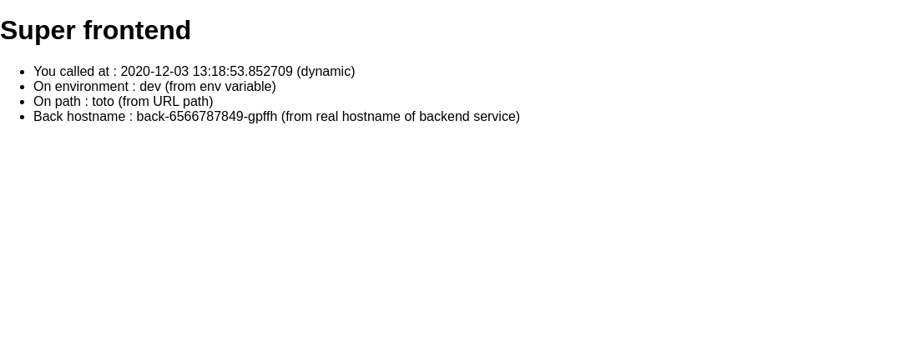
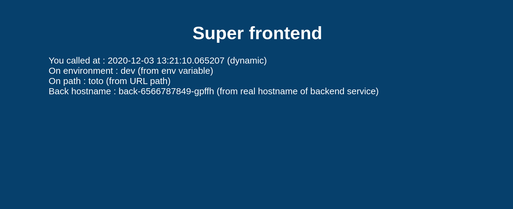

# TP 3 : Kubernetes

## Instructions
Every time we ask you to commit and push, [JUST DO IT](https://www.youtube.com/watch?v=ZXsQAXx_ao0) !! 
> The final mark will take these commits into account.

## Setup

In this lab, you will need a `kubectl` cli. You can get it by following [instructions on this page](https://kubernetes.io/docs/tasks/tools/)

To connect `kubectl` to your personal cluster, you must

* Install [azure client](https://docs.microsoft.com/en-us/cli/azure/install-azure-cli) (You should have it from the previous lab)
* Login to your account with the following command (you should be already connected from the previous lab)
```bash
az login --service-principal -u <your_app_id> -p <your_password> --tenant c8709a2a-70b6-49b5-bdd5-6868b476da85
```
* Get credentials to access your kubernetes cluster
```bash
az aks get-credentials -n aks-<firstname><lastname> -g rg-<firstname>.<lastname>
```
* To check if your setup works type the following command
```bash
kubectl get nodes -o wide
```
If you seed this kind of output, that's good !
```bash
NAME                                STATUS   ROLES   AGE   VERSION   INTERNAL-IP   EXTERNAL-IP   OS-IMAGE             KERNEL-VERSION     CONTAINER-RUNTIME
aks-nodepool1-28014497-vmss000000   Ready    agent   12h   v1.20.9   10.240.0.4    <none>        Ubuntu 18.04.6 LTS   5.4.0-1059-azure   containerd://1.4.9+azure
```


## First contact with `kubectl`

* `kubectl` is (almost) the only tool we'll need to talk to Kubernetes

* It is a rich CLI tool around the Kubernetes API (Everything you can do with `kubectl`, you can do directly with the API)

### `kubectl get`

* Let's look at our Node resources with kubectl get!

* Look at the composition of our cluster:

  ```.term1
  kubectl get node
  ```
* These commands are equivalent

  ```
  kubectl get no
  kubectl get node
  kubectl get nodes
  ```

### Obtaining machine-readable output

* `kubectl get` can output JSON, YAML, or be directly formatted

* Give us more info about the nodes:

  ```.term1
  kubectl get nodes -o wide
  ```

* Let's have some YAML:
  ```.term1
  kubectl get no -o yaml
  ```
  See that kind: List at the end? It's the type of our result!

### What's available?

* `kubectl` has pretty good introspection facilities

* We can list all available resource types by running `kubectl api-resources`

* We can view details about a resource with:
  ```
  kubectl describe type/name
  kubectl describe type name
  ```

* We can view the definition for a resource type with:
  ```
  kubectl explain type
  ```

Each time, `type` can be singular, plural, or abbreviated type name.

### Services

* A service is a stable endpoint to connect to "something" (In the initial proposal, they were called "portals")

* List the services on our cluster:

  ```.term1
  kubectl get services
  ```

This would also work:

  ```
    kubectl get svc
  ```

There is already one service on our cluster: the Kubernetes API itself.

### ClusterIP services

* A `ClusterIP` service is internal, available from the cluster only

* This is useful for introspection from within containers

* Try to connect to the API.
  * `-k` is used to skip certificate verification
  * Make sure to replace 10.96.0.1 with the CLUSTER-IP shown by `$ kubectl get svc`

  ```
  curl -k https://10.96.0.1
  ```

The error that we see is expected: the Kubernetes API requires authentication.

### Listing running containers

* Containers are manipulated through pods

* A pod is a group of containers:

  * running together (on the same node)

  * sharing resources (RAM, CPU; but also network, volumes)

* List pods on our cluster:

  ```.term1
  kubectl get pods
  ```
*These are not the pods you're looking for*. But where are they?!?

### Namespaces

* Namespaces allow us to segregate resources

* List the namespaces on our cluster with one of these commands:

  ```.term1
  kubectl get namespaces
  ```

  either of these would work as well:

  ```
  kubectl get namespace
  kubectl get ns
  ```

*You know what ... This `kube-system` thing looks suspicious.*

### Accessing namespaces
* By default, `kubectl` uses the `default` namespace

* We can switch to a different namespace with the `-n` option

* List the pods in the `kube-system` namespace:
  ```.term1
  kubectl -n kube-system get pods
  ```
*Ding ding ding ding ding!*

### What are all these pods?

* `coredns` is an additional component (not mandatory but super useful, so it's there)

* `calico` is the (per-node) component managing the network overlay

> In a real world deployment of kubernetes, you should find lots of other pods (etcd, api-server, controller-manager)

* the `READY` column indicates the number of containers in each pod

## Running our first containers on Kubernetes

* First things first: we cannot run a container

* We are going to run a pod, and in that pod there will be a single container

* In that container in the pod, we are going to run a simple ping command

* Then we are going to start additional copies of the pod

### Starting a simple pod with `kubectl run`

* We need to specify at least a name and the image we want to use

* Let's ping `8.8.8.8`, Google's public DNS

  ```.term1
  kubectl create deployment pingpong --image=alpine -- ping 8.8.8.8
  ```

* OK, what just happened?

### Behind the scenes of `kubectl create deployment`

* Let's look at the resources that were created by `kubectl create deployment`

* List most resource types:

  ```.term1
  kubectl get all
  ```

We should see the following things:

* `deployment.apps/pingpong` (the *deployment* that we just created)
* `replicaset.apps/pingpong-xxxx` (a *replica set* created by the deployment)
* `pod/pingpong-xxxx-yyyy` (a *pod* created by the replica set)

### What are these different things?

* A *deployment* is a high-level construct

  * allows scaling, rolling updates, rollbacks

  * multiple deployments can be used together to implement a [canary deployment](https://kubernetes.io/docs/concepts/cluster-administration/manage-deployment/#canary-deployments)

  * delegates pods management to *replica sets*

* A *replica set* is a low-level construct

  * makes sure that a given number of identical pods are running

  * allows scaling

  * rarely used directly

* A *replication controller* is the (deprecated) predecessor of a replica set

### Our `pingpong` deployment

* `kubectl create deployment` created a *deployment*, `deployment.apps/pingpong`

* That deployment created a *replica set*, `replicaset.apps/pingpong-xxxx`

* That *replica set* created a *pod*, `pod/pingpong-xxxx-yyyy`

* We'll see later how these folks play together for:

  * scaling

  * high availability

  * rolling updates

### Viewing container output

* Let's use the `kubectl logs` command

* We will pass either a *pod name*, or a *type/name*
(E.g. if we specify a deployment or replica set, it will get the first pod in it)

* Unless specified otherwise, it will only show logs of the first container in the pod
(Good thing there's only one in ours!)

* View the result of our ping command:

  ```.term1
  kubectl logs deploy/pingpong
  ```

### Streaming logs in real time
* Just like `docker logs`, `kubectl logs` supports convenient options:

  * `-f/--follow` to stream logs in real time (à la tail `-f`)

  * `--tail` to indicate how many lines you want to see (from the end)

  * `--since` to get logs only after a given timestamp

* View the latest logs of our ping command:

  ```.term1
  kubectl logs deploy/pingpong --tail 1 --follow
  ```

### Scaling our application

* We can create additional copies of our container (or rather our pod) with `kubectl scale`

* Scale our pingpong deployment:

  ```.term1
  kubectl scale deploy/pingpong --replicas 8
  ```

> Note: what if we tried to scale `rs/pingpong-xxxx`? We could! But the *deployment* would notice it right away, and scale back to the initial level.

### Resilience

* The deployment pingpong watches its replica set

* The replica set ensures that the right number of pods are running

* What happens if pods disappear?

* In a separate window, list pods, and keep watching them:
```.term1
kubectl get pods -w
```

  `Ctrl-C` to terminate watching.

* If you wanted to destroy a pod, you would use this pattern where `yyyy` was the identifier of the particular pod:
```
kubectl delete pod pingpong-yyyy
```

### What if we wanted something different?
* What if we wanted to start a "one-shot" container that *doesn't* get restarted?

* We could use `kubectl run --restart=OnFailure` or `kubectl run --restart=Never`

* These commands would create *jobs* or *pods* instead of *deployments*

* Under the hood, `kubectl run` invokes "generators" to create resource descriptions

* We could also write these resource descriptions ourselves (typically in YAML),
and create them on the cluster with `kubectl apply -f` (discussed later)

* With `kubectl run --schedule=`..., we can also create *cronjobs*

### Viewing logs of multiple pods

* When we specify a deployment name, only one single pod's logs are shown

* We can view the logs of multiple pods by specifying a *selector*

* A selector is a logic expression using *labels*

* Conveniently, when you `kubectl create deployment somename`, the associated objects have a `app=somename` label

* View the last line of log from all pods with the `app=pingpong` label:

  ```.term1
  kubectl logs -l app=pingpong --tail 1
  ```

* Unfortunately, `--follow` cannot (yet) be used to stream the logs from multiple containers.

### Clean-up

* Clean up your deployment by deleting `pingpong`

  ```.term1
  kubectl delete deploy/pingpong
  ```

## Exposing containers

* `kubectl expose` creates a *service* for existing pods

* A *service* is a stable address for a pod (or a bunch of pods)

* If we want to connect to our pod(s), we need to create a *service*

* Once a service is created, `coredns` will allow us to resolve it by name (i.e. after creating service `hello`, the name `hello` will resolve to something)

* There are different types of services, detailed on the following parts:

`ClusterIP`, `NodePort`, `LoadBalancer`, `ExternalName`

## Basic service types

* `ClusterIP` (default type)

  a virtual IP address is allocated for the service (in an internal, private range)
  this IP address is reachable only from within the cluster (nodes and pods)
  our code can connect to the service using the original port number

* `NodePort`

  a port is allocated for the service (by default, in the 30000-32768 range)
  that port is made available on all our nodes and anybody can connect to it
  our code must be changed to connect to that new port number

These service types are always available.

Under the hood: `kube-proxy` is using a userland proxy and a bunch of `iptables` rules.

### More service types

* `LoadBalancer`
  * an external load balancer is allocated for the service
  * the load balancer is configured accordingly (e.g.: a `NodePort` service is created, and the load balancer sends traffic to that port)

* `ExternalName`

  * the DNS entry managed by `coredns` will just be a `CNAME` to a provided record
  * no port, no IP address, no nothing else is allocated

### Running containers with open ports

* Since ping doesn't have anything to connect to, we'll have to run something else

* Start a bunch of ElasticSearch containers:
```.term1
kubectl create deployment elastic --image=elasticsearch:2 --replicas=4
```

* Watch them being started:

  ```.term1
  kubectl get pods -w
  ```

The `-w` option "watches" events happening on the specified resources.

Note: please DO NOT call the service `search`. It would collide with the TLD.

### Exposing our deployment

* We'll create a default `ClusterIP` service

* Expose the ElasticSearch HTTP API port:

  ```.term1
  kubectl expose deploy/elastic --port 9200
  ```

* Look up which IP address was allocated:

  ```.term1
  kubectl get svc
  ```

### Services are layer 4 constructs

* You can assign IP addresses to services, but they are still *layer 4* (i.e. a service is not an IP address; it's an IP address + protocol + port)

* This is caused by the current implementation of `kube-proxy` (it relies on mechanisms that don't support layer 3)

* As a result: *you have to* indicate the port number for your service

* Running services with arbitrary port (or port ranges) requires hacks (e.g. host networking mode)

### Testing our service

* We will now send a few HTTP requests to our ElasticSearch pods

* Let's obtain the IP address that was allocated for our service, *programatically*:

  ```.term1
  IP=$(kubectl get svc elastic -o go-template --template '{{ .spec.clusterIP }}')
  ```

* Send a few requests:

  ```.term1
  curl http://$IP:9200/
  ```

Our requests are load balanced across multiple pods.

### Clean up

* We're done with the `elastic` deployment, so let's clean it up

  ```.term1
  kubectl delete deploy/elastic
  ```

## Let's run our app on Kube

In `kubernetes-manifests` folder, you can find multiple manifests to deploy backend and frontend application to kubernetes cluster.

> You should see something like that:


### 1.0: Start backend deployment

The goal here is to deploy your backend pods.

Modify `kubernetes-manifests/back-deployment.yaml` file to specify `spec` part.

See [Kubernetes deployment documentation](https://kubernetes.io/docs/concepts/workloads/controllers/deployment/)

Help: 
* You must name your pods `back`
* You must use the following Docker image `arthurmauvezin/back:1.0`
* You must specify environment variable `ENVIRONMENT` to any value
* You must specify `containerPort` to `8080`
* You must setup `restartPolicy` to `Always`

> Apply your changes whenever you want with the following command `kubectl apply -f kubernetes-manifests/back-deployment.yaml`

> :warning: **WARNING**: Commit and push your code with a working `back-deployment.yaml` file


### 1.1: Start backend service

The goal here is to access your backend service

Modify `kubernetes-manifests/back-service.yaml` file to specify `spec` part.

See [Kubernetes service documentation](https://kubernetes.io/docs/concepts/services-networking/service/)

Help: 
* You must specify a `selector` to route to your pods
* You must specify `ports` to target your pods ports
* You must specify `type` to `LoadBalancer`

> Apply your changes whenever you want with the following command `kubectl apply -f <filename>`

You should be able to access your backend through the external IP provided by Azure through the Kubernetes service.
HELP: Check your services to find your IP and port

> :warning: **WARNING**: Commit and push your code with a working `back-service.yaml` file


### 1.2: Start frontend deployment

The goal here is to deploy your frontend pods.

Modify `kubernetes-manifests/front-deployment.yaml` file to specify `spec` part.

See [Kubernetes deployment documentation](https://kubernetes.io/docs/concepts/workloads/controllers/deployment/)

Help: 
* You must name your pods `front`
* You must use the following Docker image `arthurmauvezin/front:1.0`
* You must specify environment variable `WS_BACK_URL` to the URL of your backend service (you must find it in your service)
* You must specify `containerPort` to `80`
* You must setup `restartPolicy` to `Always`

> Apply your changes whenever you want with the following command `kubectl apply -f <filename>`

> :warning: **WARNING**: Commit and push your code with a working `front-deployment.yaml` file


### 1.3: Start frontend service

The goal here is to access your frontend service

Modify `kubernetes-manifests/front-service.yaml` file to specify `spec` part.

See [Kubernetes service documentation](https://kubernetes.io/docs/concepts/services-networking/service/)

Help: 
* You must specify a `selector` to route to your pods
* You must specify `ports` to target your pods ports
* You must specify `type` to `LoadBalancer`

> Apply your changes whenever you want with the following command `kubectl apply -f <filename>`

Try to access your deployed frontend on the IP specified by your newly created service.

> You should see something like that:


> Youhou !!! You just deployed a full application through Kubernetes :)

You should be able to access your frontend through the external IP provided by Azure through the Kubernetes service.
HELP: Check your services to find your IP and port

> :warning: **WARNING**: Commit and push your code with a working `front-service.yaml` file

### 1.4: Upgrade your frontend

Modify your `kubernetes-manifests/front-deployment.yaml` file to specify a new **upgraded** image of our frontend called `arthurmauvezin/front:1.1`

> Apply your changes again with the following command `kubectl apply -f <filename>`

Watch the upgrade with `kubectl get pod -w`

> You should now see a beautiful frontend like that:


> :warning: **WARNING**: Commit and push your code with a working `front-service.yaml` file
