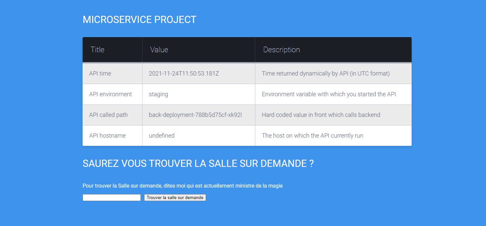

# Microservices project

## Instructions
Le projet doit être rendu individuellement et se basera sur le code présent dans vos repositories personnels.

> ⚠️  **WARNING**: Les clusters AKS (Azure Kubernetes Service) seront détruits tous les soirs. Mais n'ayez craintes, vous n'aurez qu'à relancer votre CD pour recréer le cluster automatiquement.

## 0: Description
Le but de ce projet est de mettre en oeuvre tout ce que vous avez vu durant l'année, que ce soit en terme de Git, de DevOps, de containerisation ou encore de déploiement dans le cloud.

Dans ce projet se trouve un code applicatif composé d'un frontend et d'un backend (API) qu'il va falloir containeriser, pousser sur votre registry Docker, et déployer dans un cluster Kubernetes que vous aurez préalablement créé grâce à Terraform.

Toutes ces étapes seront bien entendu à exécuter via une pipeline de CI/CD sur Github Actions.

## 1 : Les Dockerfiles, c'est eaaaaazy !
Dans un premier temps, il va falloir créer deux `Dockerfile` afin de pouvoir construire vos images Docker: une pour le front et une pour le back

N'hésitez pas tester vos images en local en démarrant des containers. Si vous avez bien packagé vos images, voila à quoi ça devrait ressembler:

## 2 : Commençons par la CI

Une fois votre image Docker construite, vous allez pouvoir la publier sur votre registry Docker (via votre CI bien entendu)

La prochaine étape sera alors de créer un pipeline de CI/CD sur Github Actions qui va permettre d'automatiser la création et la publication de votre image Docker sur votre registry Docker.

Une pipeline vous a été donné dans le dossier `.github/workflows/pipeline.yml`. Toutes les étapes sont déjà présente, il ne vous reste plus qu'à compléter le fichier afin que le build et la publication de votre image Docker soit automatisé. Bien entendu, si vous souhaitez ou que vous avez besoin d'ajouter une étape au pipeline, vous êtes libres de le faire.

Pour pouvoir faire ceci, voici le lien vers le GIthub Actions à mettre en place : https://github.com/marketplace/actions/build-and-push-docker-images

## 3: Et si on déployait l'infra automatiquement ?

Maintenant que votre image est présente sur votre registry Docker, vous allez pouvoir la déployer dans un cluster Kubernetes.

Avant de pouvoir déployer vos micro-services, la première étape est de créer un cluster Kubernetes grâce à Terraform. Nous allons utiliser le cloud provider Azure pour cela.

Un début de fichier Terraform vous a été fourni dans le dossier `terraform`. Les fichiers `resource-group.tf` et `outputs.tf` ne sont pas à modifier.

Vous devez modifier les fichiers `vaiables.tf` et `provider.tf` en mettant vos identifiants.

Puis vous n'avez plus qu'à compléter le fichier `main.tf` afin de pouvoir créer votre cluster Kubernetes. La documentation pour pouvoir créer un cluster sur Azure est disponible ici : https://registry.terraform.io/providers/hashicorp/azurerm/latest/docs/resources/kubernetes_cluster

## 4: Créer des livrables, c'est cool, mais faudrait peut être les déployer ...

Enfin, vous avez vos images et vote cluster. Il ne reste donc plus qu'à déployer :)

Créez vos manifest yaml capables de déployer votre front et votre back dans le repertoire kubernetes (les fichiers sont déjà créés, il ne reste qu'à les compléter).

Il ne vous reste plus qu'à ajouter l'étape de déploiement à votre CI/CD et le tour est joué !
